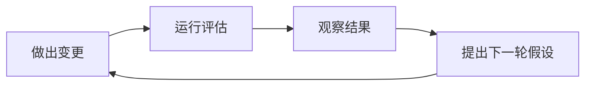

# 实验

## 什么是实验？

实验是指对应用进行的有意变更，用于验证假设或想法。例如，在检索增强生成（RAG）系统中，你可能会更换检索模型，以评估新嵌入模型对聊天机器人回答的影响。

### 良好实验的原则

1. **定义可衡量的指标**：使用准确率、精确率或召回率等指标量化变更的影响。
2. **系统化存储结果**：确保结果以有序方式存储，便于比较和追踪。
3. **隔离变更**：一次只做一处变更，以便明确其影响。避免同时做多处变更，以免掩盖结果。
4. **迭代过程**：遵循结构化流程：*做出变更 → 运行评估 → 观察结果 → 提出下一轮假设 → 再做出变更*。



## Ragas 中的实验

### 实验的组成

1. **测试数据集**：用于评估系统的数据。
2. **应用端点**：被测试的应用、组件或模型。
3. **指标**：用于评估性能的量化度量。

### 执行流程

1. **准备**：定义实验参数并加载测试数据集。
2. **运行**：在数据集中的每个样本上执行应用。
3. **评估**：应用指标衡量性能。
4. **存储**：保存结果以供分析和比较。

## 使用 Ragas 创建实验

Ragas 提供 `@experiment` 装饰器以简化实验创建。若希望先动手体验，可参阅[快速入门](../getstarted/quickstart.md)。

### 基本实验结构

```python
from ragas import experiment
import asyncio

@experiment()
async def my_experiment(row):
    # 通过你的系统处理输入
    response = await asyncio.to_thread(my_system_function, row["input"])
    
    # 返回用于评估的结果
    return {
        **row,  # 包含原始数据
        "response": response,
        "experiment_name": "baseline_v1",
        # 可添加任意额外元数据
        "model_version": "gpt-4o",
        "timestamp": datetime.now().isoformat()
    }
```

### 运行实验

```python
from ragas import Dataset

# 加载测试数据集
dataset = Dataset.load(name="test_data", backend="local/csv", root_dir="./data")

# 运行实验
results = await my_experiment.arun(dataset)
```

### 参数化实验

可以创建参数化实验以测试不同配置：

```python
@experiment()
async def model_comparison_experiment(row, model_name: str, temperature: float):
    # 用参数配置你的系统
    response = await my_system_function(
        row["input"], 
        model=model_name, 
        temperature=temperature
    )
    
    return {
        **row,
        "response": response,
        "experiment_name": f"{model_name}_temp_{temperature}",
        "model_name": model_name,
        "temperature": temperature
    }

# 用不同参数运行
results_gpt4 = await model_comparison_experiment.arun(
    dataset, 
    model_name="gpt-4o", 
    temperature=0.1
)

results_gpt35 = await model_comparison_experiment.arun(
    dataset, 
    model_name="gpt-3.5-turbo", 
    temperature=0.1
)
```

## 实验管理最佳实践

### 1. 命名一致

使用包含以下信息的描述性名称：
- 变更内容（模型、提示、参数等）
- 版本号
- 如需要可加日期/时间

```python
experiment_name = "gpt4o_v2_prompt_temperature_0.1_20241201"
```

### 2. 结果存储

实验会自动将结果保存到 `experiments/` 目录下带时间戳的 CSV 文件：

```
experiments/
├── 20241201-143022-baseline_v1.csv
├── 20241201-143515-gpt4o_improved_prompt.csv
└── 20241201-144001-comparison.csv
```

### 3. 元数据追踪

在实验结果中包含相关元数据：

```python
return {
    **row,
    "response": response,
    "experiment_name": "baseline_v1",
    "git_commit": "a1b2c3d",
    "environment": "staging",
    "model_version": "gpt-4o-2024-08-06",
    "total_tokens": response.usage.total_tokens,
    "response_time_ms": response_time
}
```

## 高级实验模式

### A/B 测试

同时测试两种方案：

```python
@experiment()
async def ab_test_experiment(row, variant: str):
    if variant == "A":
        response = await system_variant_a(row["input"])
    else:
        response = await system_variant_b(row["input"])
    
    return {
        **row,
        "response": response,
        "variant": variant,
        "experiment_name": f"ab_test_variant_{variant}"
    }

# 运行两种变体
results_a = await ab_test_experiment.arun(dataset, variant="A")
results_b = await ab_test_experiment.arun(dataset, variant="B")
```

### 多阶段实验

针对多组件的复杂系统：

```python
@experiment()
async def multi_stage_experiment(row):
    # 阶段 1：检索
    retrieved_docs = await retriever(row["query"])
    
    # 阶段 2：生成
    response = await generator(row["query"], retrieved_docs)
    
    return {
        **row,
        "retrieved_docs": retrieved_docs,
        "response": response,
        "num_docs_retrieved": len(retrieved_docs),
        "experiment_name": "multi_stage_v1"
    }
```

### 实验中的错误处理

妥善处理错误，避免丢失部分结果：

```python
@experiment()
async def robust_experiment(row):
    try:
        response = await my_system_function(row["input"])
        error = None
    except Exception as e:
        response = None
        error = str(e)
    
    return {
        **row,
        "response": response,
        "error": error,
        "success": error is None,
        "experiment_name": "robust_v1"
    }
```

## 与指标集成

实验可与 Ragas 指标无缝配合：

```python
from ragas.metrics import FactualCorrectness

@experiment()
async def evaluated_experiment(row):
    response = await my_system_function(row["input"])
    
    # 内联计算指标
    factual_score = FactualCorrectness().score(
        response=response,
        reference=row["expected_output"]
    )
    
    return {
        **row,
        "response": response,
        "factual_correctness": factual_score.value,
        "factual_reason": factual_score.reason,
        "experiment_name": "evaluated_v1"
    }
```

通过这种集成，可以在实验结果中自动计算并存储指标分数，便于随时间追踪性能改进。
