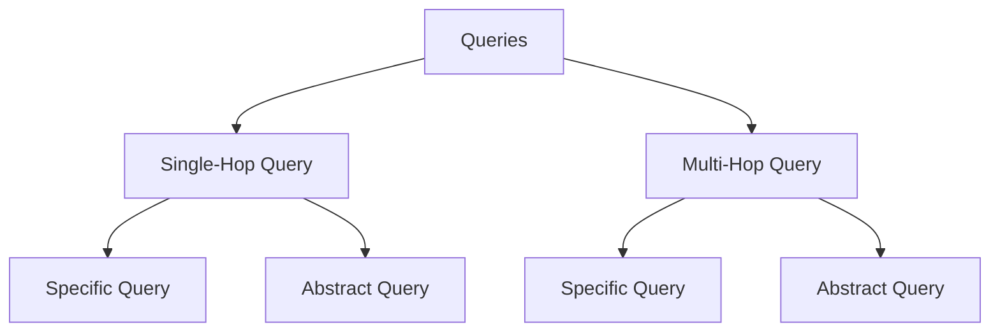
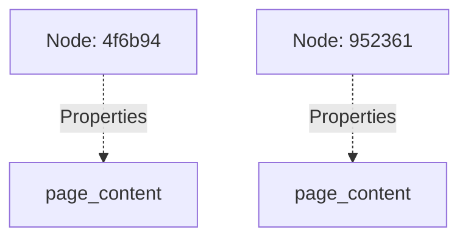
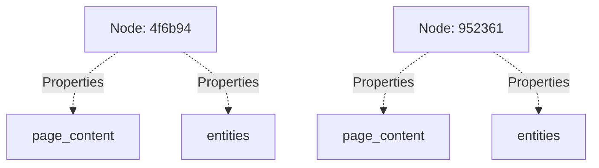
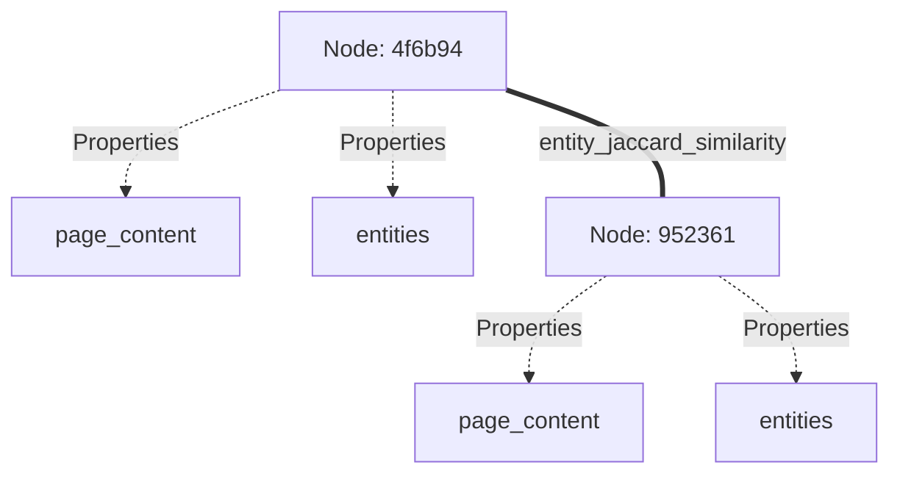

# RAG 的测试集生成

在 RAG 应用中，当用户通过你的应用与一组文档交互时，系统可能遇到不同类型的查询。我们先理解 RAG 应用中可能遇到的查询类型。

## RAG 中的查询类型



### 单跳查询（Single-Hop Query）

单跳查询是只需从单一文档或来源检索信息即可回答的简单问题，一步即可得到答案。

**示例（具体查询）：**

- “阿尔伯特·爱因斯坦在哪一年发表了相对论？”

这是一个具体的、基于事实的问题，可从包含该信息的单个文档检索回答。

**示例（抽象查询）：**

- “爱因斯坦的理论如何改变了我们对时间和空间的理解？”

该查询仍围绕单一概念（相对论），但需要从源材料得到更抽象或解释性的回答。

### 多跳查询（Multi-Hop Query）

多跳查询涉及多步推理，需要来自两个及以上来源的信息。系统必须从不同文档检索信息并串联起来才能生成准确答案。

**示例（具体查询）：**

- “哪位科学家影响了爱因斯坦在相对论上的工作，他们提出了什么理论？”

这需要系统既检索影响爱因斯坦的科学家，又检索其理论，可能来自两个不同来源。

**示例（抽象查询）：**

- “自爱因斯坦最初发表以来，相对论相关的科学理论如何演变？”

该抽象查询需要跨时间和不同来源检索多条信息，形成关于理论演变的宽泛、解释性回答。

### RAG 中的具体 vs 抽象查询

- **具体查询**：侧重清晰、基于事实的检索。在 RAG 中目标是从一个或多个文档中检索与问题直接相关的高相关性信息。
- **抽象查询**：需要更宽泛、更偏解释的回答。在 RAG 中，抽象查询会挑战检索系统从包含高层推理、解释或观点的文档中抽取内容，而非简单事实。

在单跳和多跳两种情况下，具体与抽象查询的区分都会影响检索与生成过程：是更注重精确（具体）还是综合更宽泛的观点（抽象）。

不同类型的查询需要不同的上下文来合成。为解决这一问题，Ragas 采用基于知识图谱的测试集生成方法。

## 知识图谱构建

既然我们希望从给定文档集合生成各类查询，主要挑战在于识别合适的块或文档子集，以便 LLM 生成查询。Ragas 使用基于知识图谱的测试集生成方法解决该问题。

<figure markdown="span">
  {width="auto"}
  <figcaption>知识图谱构建</figcaption>
</figure>


知识图谱由以下组件构建：

### 文档切分器

文档被切分为层次化节点。可使用不同切分器进行切分。例如对财务文档，可按章节（如利润表、资产负债表、现金流量表等）切分。你可以编写[自定义切分器]()，按与领域相关的章节切分文档。

#### 示例

```python
from ragas.testset.graph import Node

sample_nodes = [Node(
    properties={"page_content": "Einstein's theory of relativity revolutionized our understanding of space and time. It introduced the concept that time is not absolute but can change depending on the observer's frame of reference."}
),Node(
    properties={"page_content": "Time dilation occurs when an object moves close to the speed of light, causing time to pass slower relative to a stationary observer. This phenomenon is a key prediction of Einstein's special theory of relativity."}
)]
sample_nodes
```
输出：
```bash
[Node(id: 4f6b94, type: , properties: ['page_content']),
 Node(id: 952361, type: , properties: ['page_content'])]
```



### 抽取器

使用不同抽取器从每个节点抽取可用于建立节点间关系的信息。例如对财务文档，可使用实体抽取器抽取公司名称等实体、关键短语抽取器抽取节点中的重要短语等。你可以编写自定义抽取器，抽取与领域相关的信息。

抽取器可以是基于 LLM 的（继承自 `LLMBasedExtractor`）或基于规则的（继承自 `Extractor`）。

#### 示例

假设我们有一个来自知识图谱的样本节点。可使用 `NERExtractor` 从节点抽取命名实体。

```python
from ragas.testset.transforms.extractors import NERExtractor

extractor = NERExtractor()
output = [await extractor.extract(node) for node in sample_nodes]
output[0]
```
返回抽取器类型与抽取信息的元组。

```bash
('entities', ['Einstein', 'theory of relativity', 'space', 'time', "observer's frame of reference"])
```

将抽取信息加入节点。

```python
_ = [node.properties.update({key:val}) for (key,val), node in zip(output, sample_nodes)]
sample_nodes[0].properties
```

输出：
```bash
{'page_content': "Einstein's theory of relativity revolutionized our understanding of space and time. It introduced the concept that time is not absolute but can change depending on the observer's frame of reference.", 
'entities': ['Einstein', 'theory of relativity', 'space', 'time', 'observer']}
```




### 关系构建器

抽取的信息用于建立节点间关系。例如对财务文档，可根据节点中的实体建立关系。
你可以编写自己的[自定义关系构建器]()，根据与领域相关的信息建立节点间关系。

#### 示例

```python
from ragas.testset.graph import KnowledgeGraph
from ragas.testset.transforms.relationship_builders.traditional import JaccardSimilarityBuilder

kg = KnowledgeGraph(nodes=sample_nodes)
rel_builder = JaccardSimilarityBuilder(property_name="entities", key_name="PER", new_property_name="entity_jaccard_similarity")
relationships = await rel_builder.transform(kg)
relationships
```
输出：
```bash
[Relationship(Node(id: 4f6b94) <-> Node(id: 952361), type: jaccard_similarity, properties: ['entity_jaccard_similarity'])]
```
由于两个节点都包含实体「Einstein」，基于实体相似度建立了节点间关系。



下面说明如何用上述组件通过一个 `transform` 构建知识图谱，以简化操作。

### 变换（Transforms）

构建知识图谱所用的所有组件可组合成单一 `transform`，应用于知识图谱以完成构建。Transforms 由按顺序应用到知识图谱的组件列表组成，也可支持组件并行处理。使用 `apply_transforms` 方法将 transforms 应用到知识图谱。

#### 示例
使用上述组件通过一个 `transform` 构建上述知识图谱。
```python
from ragas.testset.transforms import apply_transforms
transforms = [
    extractor,
    rel_builder
    ]

apply_transforms(kg,transforms)
```


若需并行应用部分组件，可用 `Parallel` 类包装它们。

```python
from ragas.testset.transforms import KeyphraseExtractor, NERExtractor
from ragas.testset.transforms import apply_transforms, Parallel

tranforms = [
    Parallel(
        KeyphraseExtractor(),
        NERExtractor()
    ),
    rel_builder
]

apply_transforms(kg,transforms)
```


知识图谱构建完成后，可通过遍历图生成不同类型的查询。例如，要生成「比较公司 X 和公司 Y 从 FY2020 到 FY2023 的收入增长」，可遍历图找到包含该公司在该时期收入增长信息的节点。

## 场景生成

现在我们有了可用于构造正确上下文以生成任意类型查询的知识图谱。当大量用户与 RAG 系统交互时，他们可能因人物角色（如高级工程师、初级工程师等）、查询长度（短、长等）、查询风格（正式、非正式等）而以不同方式组织查询。为生成覆盖这些场景的查询，Ragas 采用基于场景的测试集生成方法。

测试集生成中的每个 `Scenario` 是以下参数的组合：

- Nodes：用于生成查询的节点
- Query Length：期望查询长度，可为 short、medium 或 long 等
- Query Style：查询风格，如 web search、chat 等
- Persona：用户角色，如 Senior Engineer、Junior Engineer 等（即将支持）

<figure markdown="span">
  {width="auto"}
  <figcaption>测试生成中的场景</figcaption>
</figure>


### 查询合成器

`QuerySynthesizer` 负责为单一查询类型生成不同场景。`generate_scenarios` 用于为单一查询类型生成场景，`generate_sample` 用于为单一场景生成查询与参考答案。下面用示例说明。

#### 示例

前述示例中我们构建了包含两个基于实体相似度相关联节点的知识图谱。假设你的 KG 中有 20 个这样的节点对，且都基于实体相似度相关。 

目标是创建 50 个不同的查询，每个查询都是关于比较两个实体的某种抽象问题。我们首先需要查询 KG 获取基于实体相似度相关的节点对，然后为每对节点生成场景，直到得到 50 个不同场景。该逻辑在 `generate_scenarios` 方法中实现。


```python
from dataclasses import dataclass
from ragas.testset.synthesizers.base_query import QuerySynthesizer

@dataclass
class EntityQuerySynthesizer(QuerySynthesizer):

    async def _generate_scenarios( self, n, knowledge_graph, callbacks):
        """
        查询带实体的节点的逻辑
        描述如何将节点、风格、长度、角色组合成 n 个场景的逻辑
        """

        return scenarios

    async def _generate_sample(
        self, scenario, callbacks
    ):

        """
        如何将每个场景转换为 EvalSample（Query, Context, Reference）的逻辑
        可创建单轮或多轮样本
        """

        return SingleTurnSample(user_input=query, reference_contexs=contexts, reference=reference)
```
