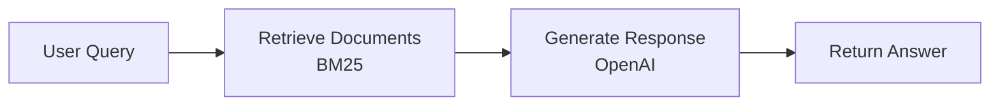
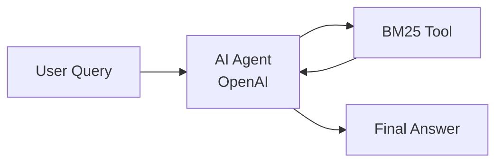

# 如何评估并改进 RAG 应用

本指南介绍如何使用 Ragas 评估 RAG（检索增强生成）应用并迭代改进。

## 你将完成的内容

- 搭建评估数据集
- 建立衡量 RAG 表现的指标
- 构建可复用的评估流水线
- 分析错误并系统性地改进 RAG 应用
- 学习如何用 Ragas 做 RAG 评估

## 配置并运行 RAG 系统

我们构建了一个简单的 RAG 系统：从 [Hugging Face 文档数据集](https://huggingface.co/datasets/m-ric/huggingface_doc) 检索相关文档，并用 LLM 生成答案。该数据集包含多份 Hugging Face 包的文档页（Markdown），适合用来测试 RAG 能力。

完整实现见：[ragas_examples/improve_rag/](https://github.com/vibrantlabsai/ragas/blob/main/examples/ragas_examples/improve_rag/)



安装依赖：

```bash
uv pip install "ragas-examples[improverag]"
```

运行 RAG 应用：

```python
import os
import asyncio
from openai import AsyncOpenAI
from ragas_examples.improve_rag.rag import RAG, BM25Retriever

# Set up OpenAI client
os.environ["OPENAI_API_KEY"] = "<your_key>"
openai_client = AsyncOpenAI()

# Create retriever and RAG system
retriever = BM25Retriever()
rag = RAG(openai_client, retriever)

# Query the system
question = "What architecture is the `tokenizers-linux-x64-musl` binary designed for?"
result = asyncio.run(rag.query(question))
print(f"Answer: {result['answer']}")
```
??? note "Output"
    ```python
    Answer: It's built for the x86_64 architecture (specifically the x86_64-unknown-linux-musl target — 64-bit Linux with musl libc).
    ```

??? example "理解 RAG 实现"
    上述代码使用一个简单的 `RAG` 类演示核心 RAG 模式，流程如下：

    ```python
    # examples/ragas_examples/improve_rag/rag.py
    from typing import Any, Dict, Optional
    from openai import AsyncOpenAI

    class RAG:
        """Simple RAG system for document retrieval and answer generation."""

        def __init__(self, llm_client: AsyncOpenAI, retriever: BM25Retriever, system_prompt=None, model="gpt-4o-mini", default_k=3):
            self.llm_client = llm_client
            self.retriever = retriever
            self.model = model
            self.default_k = default_k
            self.system_prompt = system_prompt or "Answer only based on documents. Be concise.\n\nQuestion: {query}\nDocuments:\n{context}\nAnswer:"

        async def query(self, question: str, top_k: Optional[int] = None) -> Dict[str, Any]:
            """Query the RAG system."""
            if top_k is None:
                top_k = self.default_k
                
            return await self._naive_query(question, top_k)

        async def _naive_query(self, question: str, top_k: int) -> Dict[str, Any]:
            """Handle naive RAG: retrieve once, then generate."""
            # 1. Retrieve documents using BM25
            docs = self.retriever.retrieve(question, top_k)
            
            if not docs:
                return {"answer": "No relevant documents found.", "retrieved_documents": [], "num_retrieved": 0}
            
            # 2. Build context from retrieved documents
            context = "\n\n".join([f"Document {i}:\n{doc.page_content}" for i, doc in enumerate(docs, 1)])
            prompt = self.system_prompt.format(query=question, context=context)
            
            # 3. Generate response using OpenAI with retrieved context
            response = await self.llm_client.chat.completions.create(
                model=self.model,
                messages=[{"role": "user", "content": prompt}]
            )
            
            return {
                "answer": response.choices[0].message.content.strip(),
                "retrieved_documents": [{"content": doc.page_content, "metadata": doc.metadata, "document_id": i} for i, doc in enumerate(docs)],
                "num_retrieved": len(docs)
            }
    ```

    核心 RAG 模式即：**检索相关文档 → 注入到提示 → 生成答案**。

## 创建评估数据集

我们使用 [huggingface_doc_qa_eval](https://huggingface.co/datasets/m-ric/huggingface_doc_qa_eval)，这是关于 Hugging Face 文档的问答数据集。

数据集示例行：

| Question | Expected Answer |
|----------|----------------|
| What architecture is the `tokenizers-linux-x64-musl` binary designed for? | x86_64-unknown-linux-musl |
| What is the purpose of the BLIP-Diffusion model? | The BLIP-Diffusion model is designed for controllable text-to-image generation and editing. |
| What is the purpose of the /healthcheck endpoint in the Datasets server API? | Ensure the app is running |

评估脚本会从[此处](https://raw.githubusercontent.com/vibrantlabsai/ragas/main/examples/ragas_examples/improve_rag/datasets/hf_doc_qa_eval.csv)下载数据集并转换为 Ragas Dataset 格式：

```python
# examples/ragas_examples/improve_rag/evals.py
import urllib.request
from pathlib import Path
from ragas import Dataset
import pandas as pd

def download_and_save_dataset() -> Path:
    dataset_path = Path("datasets/hf_doc_qa_eval.csv")
    dataset_path.parent.mkdir(exist_ok=True)
    
    if not dataset_path.exists():
        github_url = "https://raw.githubusercontent.com/vibrantlabsai/ragas/main/examples/ragas_examples/improve_rag/datasets/hf_doc_qa_eval.csv"
        urllib.request.urlretrieve(github_url, dataset_path)
    
    return dataset_path

def create_ragas_dataset(dataset_path: Path) -> Dataset:
    dataset = Dataset(name="hf_doc_qa_eval", backend="local/csv", root_dir=".")
    df = pd.read_csv(dataset_path)
    
    for _, row in df.iterrows():
        dataset.append({"question": row["question"], "expected_answer": row["expected_answer"]})
    
    dataset.save()
    return dataset
```

更多关于数据集的内容见 [核心概念 - 数据集](../../concepts/datasets_zh.md)。

## 配置 RAG 评估指标

有了评估数据集后，需要指标来衡量 RAG 表现。先从简单、聚焦的指标开始，直接对应你的核心场景。更多指标说明见 [核心概念 - 指标](../../concepts/metrics/index_zh.md)。

这里使用离散指标 `correctness`，判断 RAG 回答是否包含期望答案中的关键信息，且基于给定上下文事实正确。

```python
# examples/ragas_examples/improve_rag/evals.py
from ragas.metrics import DiscreteMetric

# Define correctness metric
correctness_metric = DiscreteMetric(
    name="correctness",
    prompt="""Compare the model response to the expected answer and determine if it's correct.
    
Consider the response correct if it:
1. Contains the key information from the expected answer
2. Is factually accurate based on the provided context
3. Adequately addresses the question asked

Return 'pass' if the response is correct, 'fail' if it's incorrect.

Question: {question}
Expected Answer: {expected_answer}
Model Response: {response}

Evaluation:""",
    allowed_values=["pass", "fail"],
)
```

有了评估指标后，需要在数据集上系统性地运行，这时用到 Ragas 的实验功能。

## 创建评估实验

实验函数对每个样本调用 RAG、再用 correctness 指标评估回答。更多说明见 [核心概念 - 实验](../../concepts/experimentation_zh.md)。

实验函数接收包含 question、期望上下文和期望答案的数据行，然后：

1. 用问题查询 RAG
2. 用 correctness 指标评估回答
3. 返回包含分数和理由的详细结果

```python
# examples/ragas_examples/improve_rag/evals.py
import asyncio
from typing import Dict, Any
from ragas import experiment

@experiment()
async def evaluate_rag(row: Dict[str, Any], rag: RAG, llm) -> Dict[str, Any]:
    """
    Run RAG evaluation on a single row.
    
    Args:
        row: Dictionary containing question and expected_answer
        rag: Pre-initialized RAG instance
        llm: Pre-initialized LLM client for evaluation
        
    Returns:
        Dictionary with evaluation results
    """
    question = row["question"]
    
    # Query the RAG system
    rag_response = await rag.query(question, top_k=4)
    model_response = rag_response.get("answer", "")
    
    # Evaluate correctness asynchronously
    score = await correctness_metric.ascore(
        question=question,
        expected_answer=row["expected_answer"],
        response=model_response,
        llm=llm
    )
    
    # Return evaluation results
    result = {
        **row,
        "model_response": model_response,
        "correctness_score": score.value,
        "correctness_reason": score.reason,
        "mlflow_trace_id": rag_response.get("mlflow_trace_id", "N/A"),  # MLflow trace ID for debugging (explained later)
        "retrieved_documents": [
            doc.get("content", "")[:200] + "..." if len(doc.get("content", "")) > 200 else doc.get("content", "")
            for doc in rag_response.get("retrieved_documents", [])
        ]
    }
    
    return result
```

有了数据集、指标和实验函数，就可以评估 RAG 的基线表现。

## 启动 MLflow 服务

在运行评估前需要先启动 MLflow 服务。RAG 系统会自动把 trace 写入 MLflow，便于调试和分析：

```bash
# Start MLflow server (required - in a separate terminal)
uv run mlflow ui --backend-store-uri sqlite:///mlflow.db --port 5000
```

MLflow UI 地址：[http://127.0.0.1:5000](http://127.0.0.1:5000)。

## 运行首次 RAG 实验

运行完整评估流水线，得到 RAG 的基线表现：

```python
# Import required components
import asyncio
from datetime import datetime
from ragas_examples.improve_rag.evals import (
    evaluate_rag,
    download_and_save_dataset,
    create_ragas_dataset,
    get_openai_client,
    get_llm_client
)
from ragas_examples.improve_rag.rag import RAG, BM25Retriever

async def run_evaluation():
    # Download and prepare dataset
    dataset_path = download_and_save_dataset()
    dataset = create_ragas_dataset(dataset_path)
    
    # Initialize RAG components
    openai_client = get_openai_client()
    retriever = BM25Retriever()
    rag = RAG(llm_client=openai_client, retriever=retriever, model="gpt-5-mini", mode="naive")
    llm = get_llm_client()
    
    # Run evaluation experiment
    exp_name = f"{datetime.now().strftime('%Y%m%d-%H%M%S')}_naiverag"
    results = await evaluate_rag.arun(
        dataset, 
        name=exp_name,
        rag=rag,
        llm=llm
    )
    
    # Print results
    if results:
        pass_count = sum(1 for result in results if result.get("correctness_score") == "pass")
        total_count = len(results)
        pass_rate = (pass_count / total_count) * 100 if total_count > 0 else 0
        print(f"Results: {pass_count}/{total_count} passed ({pass_rate:.1f}%)")
    
    return results

# Run the evaluation
results = await run_evaluation()
print(results)
```

脚本会下载数据集、初始化 BM25 检索器、对每个样本运行实验，并把详细结果保存到 `experiments/` 目录的 CSV 中供分析。


??? note "Output"
    ```python
    Results: 43/66 passed (65.2%)
    Evaluation completed successfully!

    Detailed results:
    Experiment(name=20250924-212541_naiverag,  len=66)
    ```

在 65.2% 通过率下我们有了基线。`experiments/` 中的详细 CSV 已包含错误分析和系统性改进所需的数据。

### 在 MLflow 中查看 Trace

实验结果的 CSV 中每条评估都有 `mlflow_trace_id` 和 `mlflow_trace_url`，便于分析单次执行的详细 trace，判断失败发生在检索、生成还是评估步骤。

RAG 系统会把 trace 自动写入之前启动的 MLflow 服务，可在 [http://127.0.0.1:5000](http://127.0.0.1:5000) 查看。

你可以：

1. **在 CSV 中分析结果**：查看回答、指标分数与理由
2. **结合 Trace 深入排查**：点击结果中的 `mlflow_trace_url` 在 MLflow UI 中打开该次评估的完整执行 trace

!!! tip "技巧：点击 Trace 链接调试"
    每条评估结果都包含 `mlflow_trace_url`，可直接在 MLflow UI 中打开对应 trace，无需手动复制 ID 或翻页。


## 分析错误与失败模式

运行评估后，查看 `experiments/` 下的结果 CSV，找出失败案例中的规律。每行都有 `mlflow_trace_id`/`mlflow_trace_url`，可在 MLflow UI 中查看详细执行 trace。对每个失败案例做标注，便于归纳并改进应用。

### 本示例评估中的实际失败模式

本示例中的核心问题是**检索失败**——BM25 检索器没有找到包含答案的文档。模型会按指令在文档缺失时说明“未包含相关信息”，但实际是检索到了错误文档。

**文档检索不佳示例**

BM25 检索器未能检索到包含答案的文档：

| Question | Expected Answer | Model Response | Root Cause |
|----------|----------------|----------------|------------|
| "What is the default repository type for create_repo?" | `model` | "The provided documents do not state the default repository type..." | **BM25 未命中包含 create_repo 说明的文档** |
| "What is the purpose of the BLIP-Diffusion model?" | "controllable text-to-image generation and editing" | "The provided documents do not mention BLIP‑Diffusion..." | **BM25 未检索到 BLIP-Diffusion 相关文档** |
| "What is the name of the new Hugging Face library for hosting scikit-learn models?" | `Skops` | "The provided documents do not mention or name any new Hugging Face library..." | **BM25 未命中 Skops 文档** |

由此可以确定主要瓶颈在检索，下面针对检索做改进。

## 改进 RAG 应用

检索被确认为主要瓶颈后，可以从两条路线改进：

**传统做法**包括更好的分块、混合检索或向量 embedding。但本示例中 BM25 单次查询经常漏掉相关文档，因此我们采用**智能体（Agentic）方式**。

**Agentic RAG** 让 AI 迭代优化检索策略——尝试多种搜索词并在认为上下文足够时停止，而不是依赖单次静态查询。

### Agentic RAG 实现



对示例问题运行 Agentic RAG：

```python
# Switch to agentic mode
rag_agentic = RAG(openai_client, retriever, mode="agentic")

question = "What architecture is the `tokenizers-linux-x64-musl` binary designed for?"
result = await rag_agentic.query(question)
print(f"Answer: {result['answer']}")
```

??? note "Output"
    ```python
    Answer: It targets x86_64 — i.e. the x86_64-unknown-linux-musl target triple.
    ```

??? example "理解 Agentic RAG 实现"
    Agentic RAG 模式使用 OpenAI Agents SDK 创建带 BM25 检索工具的 AI 智能体：

    ```python
    # Key components from the RAG class when mode="agentic"
    from agents import Agent, Runner, function_tool

    def _setup_agent(self):
        """Setup agent for agentic mode."""
        @function_tool
        def retrieve(query: str) -> str:
            """Search documents using BM25 retriever for a given query."""
            docs = self.retriever.retrieve(query, self.default_k)
            if not docs:
                return "No documents found."
            return "\n\n".join([f"Doc {i}: {doc.page_content}" for i, doc in enumerate(docs, 1)])

        self._agent = Agent(
            name="RAG Assistant",
            model=self.model,
            instructions="Use short keywords to search. Try 2-3 different searches. Only answer based on documents. Be concise.",
            tools=[retrieve]
        )

    async def _agentic_query(self, question: str, top_k: int) -> Dict[str, Any]:
        """Handle agentic mode: agent controls retrieval strategy."""
        result = await Runner.run(self._agent, input=question)
        print(result.answer)
    ```

    与 naive 模式的单次检索不同，智能体会自主决定何时、如何检索，尝试多组关键词直到认为上下文足够。

## 再次运行实验并对比结果

对 Agentic RAG 进行评估：

```python
# Import required components
import asyncio
from datetime import datetime
from dotenv import load_dotenv

# Load environment variables
load_dotenv()

from ragas_examples.improve_rag.evals import (
    evaluate_rag,
    download_and_save_dataset, 
    create_ragas_dataset,
    get_openai_client,
    get_llm_client
)
from ragas_examples.improve_rag.rag import RAG, BM25Retriever

async def run_agentic_evaluation():
    # Download and prepare dataset
    dataset_path = download_and_save_dataset()
    dataset = create_ragas_dataset(dataset_path)
    
    # Initialize RAG components with agentic mode
    openai_client = get_openai_client()
    retriever = BM25Retriever()
    rag = RAG(llm_client=openai_client, retriever=retriever, model="gpt-5-mini", mode="agentic")
    llm = get_llm_client()
    
    # Run evaluation experiment
    exp_name = f"{datetime.now().strftime('%Y%m%d-%H%M%S')}_agenticrag"
    results = await evaluate_rag.arun(
        dataset, 
        name=exp_name,
        rag=rag,
        llm=llm
    )
    
    # Print results
    if results:
        pass_count = sum(1 for result in results if result.get("correctness_score") == "pass")
        total_count = len(results)
        pass_rate = (pass_count / total_count) * 100 if total_count > 0 else 0
        print(f"Results: {pass_count}/{total_count} passed ({pass_rate:.1f}%)")
    
    return results

# Run the agentic evaluation
results = await run_agentic_evaluation()
print("\nDetailed results:")
print(results)
```

??? note "Agentic RAG 评估输出"
    ```python
    Results: 58/66 passed (87.9%)
    ```

从 65.2%（naive）提升到 87.9%（agentic），即采用 Agentic RAG 带来约 22.7 个百分点的提升。

### 表现对比

| Approach | Correctness | Improvement |
|----------|-----------|-------------|
| **Naive RAG** | 65.2% | - |
| **Agentic RAG** | **87.9%** | **+22.7%** |


## 将这一套用到你的 RAG 系统

按以下步骤系统性地改进任意 RAG 系统：

1. **创建评估数据集**：使用系统中的真实查询，或用 LLM 生成合成数据。
2. **定义指标**：选择与场景匹配的简单指标，保持聚焦。
3. **运行基线评估**：测量当前表现并分析错误模式，找出系统性失败原因。
4. **针对性改进**：根据错误分析改进检索（分块、混合检索）、生成（提示、模型），或尝试 Agentic 方式。
5. **对比与迭代**：用改进版本与基线对比，一次改一点，直到准确率满足业务要求。

Ragas 负责编排和结果汇总，你可以把精力放在分析和改进上，而不是搭建评估基础设施。
