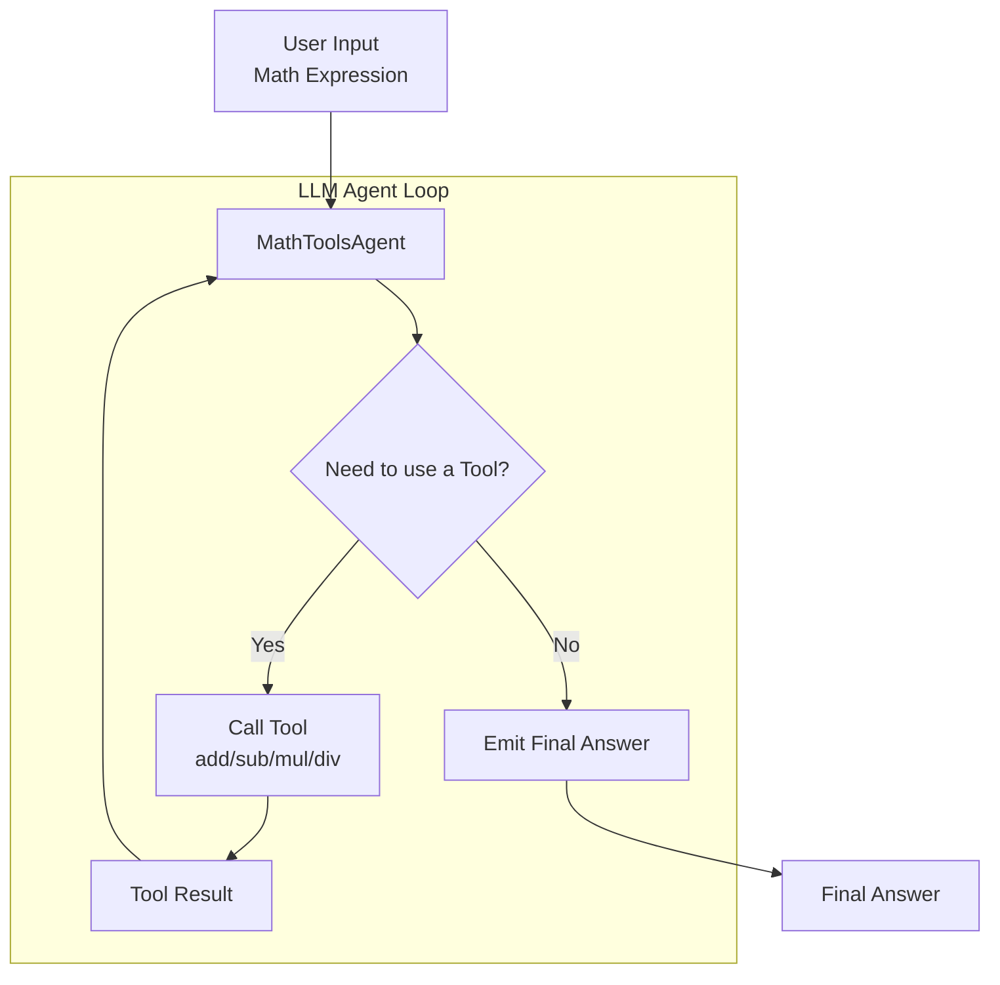

# 评估 AI 智能体

本教程演示如何使用 Ragas 评估 AI 智能体，具体是一个能通过原子运算和函数调用能力求解复杂表达式的数学智能体。学完本教程后，你将掌握如何通过评估驱动开发来评估并迭代智能体。



我们将从一个简单智能体开始：它能使用原子运算和函数调用能力求解数学表达式。

```bash
python -m ragas_examples.agent_evals.agent
```

接下来，我们为智能体创建若干示例表达式和期望输出，并转换为 CSV 文件。

```python
import pandas as pd

dataset = [
    {"expression": "(2 + 3) * (4 - 1)", "expected": 15},
    {"expression": "5 * (6 + 2)", "expected": 40},
    {"expression": "10 - (3 + 2)", "expected": 5},
]

df = pd.DataFrame(dataset)
df.to_csv("datasets/test_dataset.csv", index=False)
```

为了评估智能体的性能，我们定义一个非 LLM 指标：判断智能体输出是否在期望输出的给定容差范围内，并据此返回 1/0。

```python
from ragas.metrics import numeric_metric
from ragas.metrics.result import MetricResult

@numeric_metric(name="correctness")
def correctness_metric(prediction: float, actual: float):
    """Calculate correctness of the prediction."""
    if isinstance(prediction, str) and "ERROR" in prediction:
        return 0.0
    result = 1.0 if abs(prediction - actual) < 1e-5 else 0.0
    return MetricResult(value=result, reason=f"Prediction: {prediction}, Actual: {actual}")
```

接下来，我们编写实验循环：在测试数据集上运行智能体，使用该指标进行评估，并将结果保存到 CSV 文件。

```python
from ragas import experiment

@experiment()
async def run_experiment(row):
    expression = row["expression"]
    expected_result = row["expected"]

    # Get the model's prediction
    prediction = math_agent.solve(expression)

    # Calculate the correctness metric
    correctness = correctness_metric.score(prediction=prediction.get("result"), actual=expected_result)

    return {
        "expression": expression,
        "expected_result": expected_result,
        "prediction": prediction.get("result"),
        "log_file": prediction.get("log_file"),
        "correctness": correctness.value
    }
```

此后，每次修改智能体时，都可以运行实验，查看对智能体性能的影响。

## 端到端运行示例

1. 配置你的 OpenAI API 密钥
```bash
export OPENAI_API_KEY="your_api_key_here"
```

2. 运行评估
```bash
python -m ragas_examples.agent_evals.evals
```

完成！你已经成功使用 Ragas 评估了 AI 智能体。现在可以打开 `experiments/experiment_name.csv` 文件查看结果。
