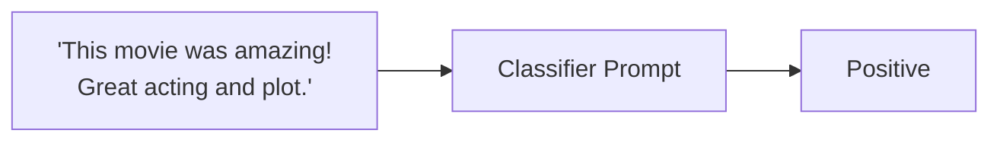

# 提示词评估

本教程将编写一个简单的评估流水线，用于评估 AI 系统中的提示词，这里以电影评论情感分类器为例。学完本教程后，你将掌握如何通过评估驱动开发来评估并迭代单个提示词。




我们将从一个简单提示词开始：将电影评论分类为正面或负面。

首先，请确保已安装 ragas examples 并配置好 OpenAI API 密钥：

```bash
pip install ragas[examples]
export OPENAI_API_KEY = "your_openai_api_key"
```

然后测试该提示词：

```bash
python -m ragas_examples.prompt_evals.prompt
```

这将使用输入 `"The movie was fantastic and I loved every moment of it!"` 进行测试，输出应为 `"positive"`。

> **💡 快速开始**：若想直接看到完整评估效果，可跳转到[端到端运行示例](#端到端运行示例)，一键运行并自动生成 CSV 结果。

接下来，我们为提示词写下若干示例输入和期望输出，并转换为 CSV 文件。

```python
import pandas as pd

samples = [{"text": "I loved the movie! It was fantastic.", "label": "positive"},
    {"text": "The movie was terrible and boring.", "label": "negative"},
    {"text": "It was an average film, nothing special.", "label": "positive"},
    {"text": "Absolutely amazing! Best movie of the year.", "label": "positive"}]
pd.DataFrame(samples).to_csv("datasets/test_dataset.csv", index=False)
```

我们需要一种方式衡量提示词在该任务上的表现。我们将定义一个指标，将提示词输出与期望输出比较，并据此输出通过/不通过。

```python
from ragas.metrics import discrete_metric
from ragas.metrics.result import MetricResult

@discrete_metric(name="accuracy", allowed_values=["pass", "fail"])
def my_metric(prediction: str, actual: str):
    """Calculate accuracy of the prediction."""
    return MetricResult(value="pass", reason="") if prediction == actual else MetricResult(value="fail", reason="")
```

接下来，我们编写实验循环：在测试数据集上运行提示词，使用该指标进行评估，并将结果保存到 CSV 文件。

```python
from ragas import experiment

@experiment()
async def run_experiment(row):
    
    response = run_prompt(row["text"])
    score = my_metric.score(
        prediction=response,
        actual=row["label"]
    )

    experiment_view = {
        **row,
        "response":response,
        "score":score.value,
    }
    return experiment_view
```

此后，每次修改提示词时，都可以运行实验，查看对提示词性能的影响。

### 传递额外参数

你可以向实验函数传递额外参数，例如模型或配置：

```python
@experiment()
async def run_experiment(row, model):
    response = run_prompt(row["text"], model=model)
    score = my_metric.score(
        prediction=response,
        actual=row["label"]
    )

    experiment_view = {
        **row,
        "response": response,
        "score": score.value,
    }
    return experiment_view

# Run with specific parameters
run_experiment.arun(dataset, "gpt-4")

# Or use keyword arguments
run_experiment.arun(dataset, model="gpt-4o")
```


## 端到端运行示例

1. 配置你的 OpenAI API 密钥
```bash
export OPENAI_API_KEY = "your_openai_api_key"
```
2. 运行评估
```bash
python -m ragas_examples.prompt_evals.evals
```

该命令将：

- 创建包含示例电影评论的测试数据集
- 对每个样本运行情感分类提示词
- 使用准确率指标评估结果
- 将所有结果导出到 CSV 文件

完成！你已经成功使用 Ragas 完成了第一次评估。现在可以打开 `experiments/experiment_name.csv` 文件查看结果。
