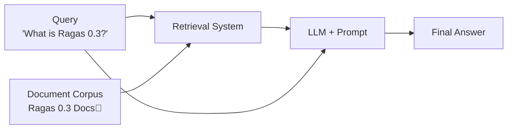

# 评估简单 RAG 系统

本教程将编写一个简单的评估流水线，用于评估 RAG（检索增强生成）系统。学完本教程后，你将掌握如何通过评估驱动开发来评估并迭代 RAG 系统。



我们将从一个简单 RAG 系统开始：从文档库中检索相关文档，并使用 LLM 生成答案。

```bash
python -m ragas_examples.rag_eval.rag
```


接下来，我们为 RAG 系统写下若干示例查询和期望输出，并转换为 CSV 文件。

```python
import pandas as pd

samples = [
    {"query": "What is Ragas 0.3?", "grading_notes": "- Ragas 0.3 is a library for evaluating LLM applications."},
    {"query": "How to install Ragas?", "grading_notes": "- install from source  - install from pip using ragas[examples]"},
    {"query": "What are the main features of Ragas?", "grading_notes": "organised around - experiments - datasets - metrics."}
]
pd.DataFrame(samples).to_csv("datasets/test_dataset.csv", index=False)
```

为了评估 RAG 系统的性能，我们定义一个基于 LLM 的指标：将 RAG 系统输出与评分说明进行比较，并据此输出通过/不通过。

```python
from ragas.metrics import DiscreteMetric
my_metric = DiscreteMetric(
    name="correctness",
    prompt = "Check if the response contains points mentioned from the grading notes and return 'pass' or 'fail'.\nResponse: {response} Grading Notes: {grading_notes}",
    allowed_values=["pass", "fail"],
)
```

接下来，我们编写实验循环：在测试数据集上运行 RAG 系统，使用该指标进行评估，并将结果保存到 CSV 文件。

```python
@experiment()
async def run_experiment(row):
    response = rag_client.query(row["query"])
    
    score = my_metric.score(
        llm=llm,
        response=response.get("answer", " "),
        grading_notes=row["grading_notes"]
    )

    experiment_view = {
        **row,
        "response": response.get("answer", ""),
        "score": score.value,
        "log_file": response.get("logs", " "),
    }
    return experiment_view
```

此后，每次修改 RAG 流水线时，都可以运行实验，查看对 RAG 性能的影响。

## 端到端运行示例

1. 配置你的 OpenAI API 密钥
```bash
export OPENAI_API_KEY="your_openai_api_key"
```
2. 运行评估
```bash
python -m ragas_examples.rag_eval.evals
```

完成！你已经成功使用 Ragas 完成了第一次评估。现在可以打开 `experiments/experiment_name.csv` 文件查看结果。
