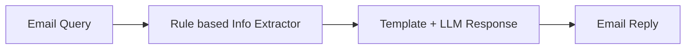

# 评估 AI 工作流

本教程演示如何使用 Ragas 评估 AI 工作流，这里以一个简单的自定义邮件支持分流工作流为例。学完本教程后，你将掌握如何通过评估驱动开发来评估并迭代工作流。



我们将从一个简单工作流开始：从邮件中提取必要信息、路由到对应模板，并使用 LLM 生成回复。

```bash
python -m ragas_examples.workflow_eval.workflow
```


接下来，我们为工作流写下若干示例邮件查询和期望输出，并将它们转换为 CSV 文件。

```python
import pandas as pd

dataset_dict = [
    {
        "email": "Hi, I'm getting error code XYZ-123 when using version 2.1.4 of your software. Please help!",
        "pass_criteria": "category Bug Report; product_version 2.1.4; error_code XYZ-123; response references both version and error code"
    },
    
    {
        "email": "I need to dispute invoice #INV-2024-001 for 299.99 dollars. The charge seems incorrect.",
        "pass_criteria": "category Billing; invoice_number INV-2024-001; amount 299.99; response references invoice and dispute process"
    }]
pd.DataFrame(dataset_dict).to_csv("datasets/test_dataset.csv", index=False)
```

为了评估工作流的性能，我们将定义一个基于 LLM 的指标，将工作流输出与通过标准进行比较，并据此输出通过/不通过。

```python
from ragas.metrics import DiscreteMetric

my_metric = DiscreteMetric(
    name="response_quality",
    prompt="Evaluate the response based on the pass criteria: {pass_criteria}. Does the response meet the criteria? Return 'pass' or 'fail'.\nResponse: {response}",
    allowed_values=["pass", "fail"],
)
```

接下来，我们编写评估实验循环：在测试数据集上运行工作流，使用该指标进行评估，并将结果保存到 CSV 文件。

```python
from ragas import experiment

@experiment()
async def run_experiment(row):
    response = workflow_client.process_email(
        row["email"]
    )
    
    score = my_metric.score(
        llm=llm,
        response=response.get("response_template", " "),
        pass_criteria=row["pass_criteria"]
    )

    experiment_view = {
        **row,
        "response": response.get("response_template", " "),
        "score": score.value,
        "score_reason": score.reason,
    }
    return experiment_view
```

此后，每次修改工作流时，都可以运行实验，查看对工作流性能的影响，并与之前的结果对比，了解是提升还是下降。

## 端到端运行示例

1. 配置你的 OpenAI API 密钥
```bash
export OPENAI_API_KEY="your_openai_api_key"
```

2. 运行实验
```bash
python -m ragas_examples.workflow_eval.evals
```

完成！你已经成功使用 Ragas 完成了第一次评估。现在可以打开 `experiments/experiment_name.csv` 文件查看结果。
